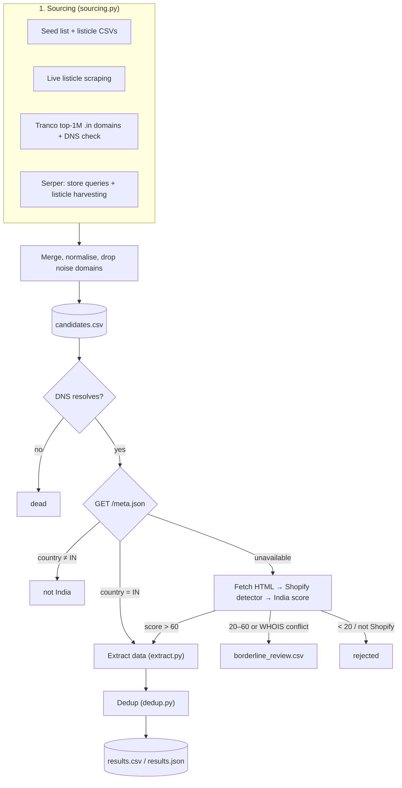

# Indian Shopify Finder

A pipeline that discovers Indian Shopify stores, verifies them, and pulls contact and brand data for each one.

**Current output: 2,026 verified Indian Shopify stores**, up from 303 in v1. Results are in `data/results.csv` and `data/results.json`.

---

## Table of Contents
1. [Results](#results)
2. [Quick Start](#quick-start)
3. [How It Works](#how-it-works)
4. [Candidate Sources](#candidate-sources)
5. [Verification Logic](#verification-logic)
6. [Data Extraction](#data-extraction)
7. [Output Files & Schema](#output-files--schema)
8. [Configuration & CLI](#configuration--cli)
9. [Project Structure](#project-structure)
10. [v1 → v2: What Changed and Why](#v1--v2-what-changed-and-why)
11. [Known Limitations](#known-limitations)
12. [Performance & Tuning](#performance--tuning)
13. [Politeness & Ethics](#politeness--ethics)

---

## Results

### Last run

| Metric | v1 | v2 |
|---|---|---|
| Candidates checked | 2,453 | 5,012 |
| **Final stores (after dedup)** | **303** | **2,026** |
| Borderline (manual review) | 721 | 9 |
| Blocked by robots.txt | 679 | 75 |
| Runtime | ~5–6 min | ~140 min |

### Funnel

```
5,012 candidates
  ├─   197  dead (no DNS record)
  ├─   330  fetch failed / errored
  ├─ 1,463  not Shopify
  ├─    75  blocked by robots.txt
  └─ 2,947  confirmed Shopify
        ├─   846  not India (meta.json country ≠ IN, or low score)
        ├─     9  borderline → data/borderline_review.csv
        └─ 2,092  confirmed Indian
              └─ 2,026  after deduplication
```

### How each store was verified

| Signal | Stores |
|---|---|
| Shopify `/meta.json` reports `country: "IN"` | 2,000 |
| Heuristic confidence score (fallback) | 26 |

### Where the stores came from

| Source | Final stores |
|---|---|
| Tranco top-1M `.in` domains + DNS (hosted on Shopify IPs) | 1,027 |
| Serper listicle harvesting (links found in search-result articles) | 418 |
| Existing CSVs (`large_static_candidates.csv`, `sister_brands.csv`, `seed_list.csv`) | 359 |
| Serper direct store queries | 217 |
| Live static listicles | 5 |

### Field coverage (share of stores with each field)

| Field | Found | Missing |
|---|---|---|
| state | 99.5% | 0.5% |
| tagline | 94.1% | 5.9% |
| category | 75.2% | 24.8% |
| socials | 89.7% | 10.3% |
| emails | 86.8% | 13.2% |
| logo_url | 87.7% | 12.3% |
| phones | 72.4% | 27.6% |

Top states: Maharashtra (442), Delhi (313), Haryana (190), Karnataka (184), Uttar Pradesh (172), Gujarat (164).

---

## Quick Start

```bash
python -m venv venv
source venv/bin/activate          # Windows: venv\Scripts\activate
pip install -r requirements.txt
```

Optionally add a [Serper](https://serper.dev) key to `.env` (the free tier has 2,500 queries):
```
SERPER_API_KEY=your_key_here
SERPER_MAX_QUERIES=200
```

Run:
```bash
python -m src.pipeline                          # full run, all sources
python -m src.pipeline --no-serper              # rerun without spending Serper credits
python -m src.pipeline --limit 100              # quick test on the first 100 candidates
```

---

## How It Works



Candidates are processed in parallel (40 threads by default). Each one moves through the stages above and ends in exactly one bucket: `dead`, `blocked`, `failed_html`, `not_shopify`, `not_india`, `borderline` or `success`.

---

## Candidate Sources

All sources are in `src/sourcing.py` and merged by `find_candidate_domains()`. Each domain is lower-cased, loses its `www.` prefix, and is checked against a noise blocklist. The blocklist covers marketplaces (Amazon, Flipkart, Myntra…), social networks, news and media sites, SaaS and e-commerce tools, and government or education suffixes.

### 1. Static CSVs
- `data/seed_list.csv`: a small hand-picked list of known brands.
- `data/large_static_candidates.csv`: domains pulled from D2C "top brands" articles in earlier runs.
- `data/sister_brands.csv`: brands related to already-confirmed stores.

### 2. Live static listicles
`source_from_static_lists()` downloads a fixed set of "Top Indian D2C brands" articles and collects outbound links plus any domain names written in the text. This function existed in v1 but was never called.

### 3. Tranco + DNS (the biggest source)
`source_from_tranco_dns()`:
1. Downloads the [Tranco](https://tranco-list.eu) top-1M domain list (cached as `data/tranco_top1m.csv`).
2. Keeps India-TLD domains: `.in`, `.co.in`, `.net.in`, `.org.in`, `.firm.in`, `.gen.in`, `.ind.in`. That's about 9,800 domains.
3. Looks up the IP address of each domain and its `www.` host with 200 threads. Shopify serves custom-domain storefronts from **`23.227.38.x`**, so a match means the site is very likely on Shopify.
4. Saves the ~1,100 matches to `data/tranco_shopify_in.csv`, so later runs skip the lookups.

DNS lookups are much cheaper than HTTP requests, so this checks thousands of domains in a couple of minutes.

### 4. Serper (Google Search API)
`source_from_serper()` runs two kinds of queries, alternating between them so even a small budget covers both:
- **Store queries**, e.g. `"skincare brand india shop online"`. Domains in the results become candidates directly.
- **Listicle queries**, e.g. `"best indian {category} brands d2c"`. The result pages are articles, so the pipeline opens each one and collects its outbound links. One article can list dozens of brands.

The queries cover about 50 categories (skincare, sarees, ghee, eyewear…). The budget is capped by `SERPER_MAX_QUERIES` (default 200), and usage is tracked in `data/serper_usage.json` against the 2,500-query free tier.

### 5. Common Crawl (kept, not used by default)
`source_from_common_crawl_myshopify()` and `source_from_common_crawl_in()` remain from v1. They are slow, rate-limited and return few Indian stores (see [Known Limitations](#known-limitations)).

---

## Verification Logic

Logic is in `process_candidate()` in `src/pipeline.py`.

### Step 0: DNS pre-filter
`resolves()` in `src/shopify_meta.py` drops domains with no DNS record (including the `www.` variant) before any HTTP request. This prevents threads from hanging on dead hosts, which caused the socket exhaustion seen in v1.

### Step 1: Shopify `/meta.json` (the main check)
Every Shopify storefront publishes a public JSON file with the shop's own settings:

```json
// https://mamaearth.in/meta.json
{ "name": "Mamaearth", "country": "IN", "currency": "INR", "province": "Haryana", "myshopify_domain": "...", ... }
```

`fetch_shopify_meta()` reads it and accepts it only if it is real JSON that contains `myshopify_domain` or `currency`.

| meta.json result | Decision |
|---|---|
| `country == "IN"` | **Accepted.** Shopify and India confirmed in a single request. |
| any other country | **Rejected** as not India. |
| missing / 404 / not JSON | Fall through to Step 2. |

The country comes from the merchant's own store settings, so multi-currency widgets can't fool it the way they fool page-text checks. This one check replaced most of the v1 heuristics.

### Step 2: Heuristic fallback (only when meta.json is unavailable)
1. **Shopify detection** (`src/shopify_detect.py`): looks for `cdn.shopify.com` / `myshopify.com` in the HTML (+50), the `shopify-checkout-api-token` meta tag (+30), the `Shopify.theme` JS object (+20), and Shopify response headers (+30 each). The site needs at least 40.
2. **India confidence score** (`src/india_detect.py`): combines the signals below from the homepage, its footer, and up to 3 contact, about or policy subpages.

| Signal | Points |
|---|---|
| `+91` phone prefix | +40 |
| Shopify base currency is INR (`Shopify.currency = {"active":"INR","rate":"1.0"}`) | +40 |
| Indian state or city (whole-word match, 34 states/UTs, 29 cities) | +30 |
| `.in` TLD | +30 |
| Currency text: `₹`, `\bINR\b`, `Rs. 499` | +20 |
| WHOIS registrant country is India | +15 |
| 6-digit PIN code **within 100 characters of** an Indian location or the word "india" | +15 |
| `<html lang="en-IN">` | +10 |

| Score | Decision |
|---|---|
| > 60 | accepted |
| 20–60, or a non-Indian WHOIS country that isn't privacy-shielded | borderline → `borderline_review.csv` |
| < 20 | rejected |

### Step 3: Deduplication (`src/dedup.py`)
Records are treated as duplicates when they share a normalised domain or an identical logo URL, or when their taglines are at least 85% similar (`difflib`). Cheap pre-checks (`real_quick_ratio`, `quick_ratio`) keep the pairwise comparison fast at 2,000+ records.

---

## Data Extraction

`extract_store_data()` in `src/extract.py` scans the homepage plus up to 3 contact and about subpages.

| Field | How |
|---|---|
| `store_name`, `city` | from `/meta.json` |
| `state` | `/meta.json` `province` first, otherwise a whole-word state match in the page text |
| `emails` | regex, ignoring `sentry.io`, `shopify.com`, `example.com`, `w3.org` |
| `phones` | `+91` / `0091` mobile numbers normalised to `+91XXXXXXXXXX`; toll-free normalised to `1800-XXX-XXXX` |
| `socials` | first link each for Instagram, Facebook, Twitter/X, LinkedIn, YouTube |
| `category` | keyword match on the meta description, then `og:type`, then the page body |
| `tagline` | meta description, otherwise the first `h1`/`h2` |
| `logo_url` | `` with "logo" in its class/id/alt inside header/nav, otherwise a JSON-LD `"logo"` |

---

## Output Files & Schema

| File | Contents |
|---|---|
| `data/results.csv` / `results.json` | **Final verified stores** |
| `data/candidates.csv` | Every candidate domain and the source that found it |
| `data/borderline_review.csv` | Stores that need manual review (`url`, `confidence`, `evidence`) |
| `data/blocked_by_robots.csv` | Domains whose robots.txt disallows us |
| `data/tranco_shopify_in.csv` | Cached Tranco + DNS hits (delete to re-scan) |
| `data/checkpoint.csv` | Partial results saved every 25 stores *(gitignored)* |
| `data/tranco_top1m.csv` | Cached Tranco list, ~22 MB *(gitignored)* |
| `data/serper_usage.json` | Serper query counter *(gitignored)* |

### `results.csv` columns

| Column | Description |
|---|---|
| `domain_url` | `https://<domain>` |
| `store_name` | Shop name from meta.json |
| `emails`, `phones` | Lists |
| `socials` | Dict `{platform: url}` |
| `category`, `tagline`, `logo_url` | Strings |
| `state`, `city` | Location (lower-case state) |
| `*_found` | Booleans used to compute the miss rates |
| `source` | Which source found the domain |
| `india_signal` | Why the store was accepted, e.g. `meta.json country=IN (Haryana)` |
| `india_confidence` | 100 for meta.json, otherwise the heuristic score |
| `whois_shielded` | WHOIS privacy flag (heuristic path only) |
| `foreign_brand_india_storefront` | True for stores on `in.brand.com` (e.g., `in.loccitane.com`). Included but flagged as deciding if they count as "Indian" is an edge-case judgment call. |

---

## Configuration & CLI

```
python -m src.pipeline [--limit N] [--workers N] [--no-serper] [--no-tranco] [--no-static]
```

| Flag / env var | Default | Purpose |
|---|---|---|
| `--limit N` | all | Process only the first N candidates |
| `--workers N` | 40 | Number of threads |
| `--no-serper` | off | Skip Serper (saves credits on reruns) |
| `--no-tranco` | off | Skip Tranco + DNS |
| `--no-static` | off | Skip live listicle scraping |
| `SERPER_API_KEY` | — | Enables the Serper source |
| `SERPER_MAX_QUERIES` | 200 | Serper queries per run |

The 2-second delay between requests to the same host is set in `src/http_utils.py` (`RateLimitedClient(delay=2.0)`).

---

## Project Structure

```
src/
  pipeline.py        orchestration, decision flow, summary report, CLI
  sourcing.py        all candidate sources + noise blocklist
  shopify_meta.py    /meta.json lookup, DNS helpers (resolves, is_shopify_dns)
  shopify_detect.py  HTML/header-based Shopify detection (fallback)
  india_detect.py    heuristic India confidence engine (fallback)
  extract.py         field extraction
  dedup.py           deduplication
  http_utils.py      rate-limited HTTP client, robots.txt handling, connection pool
data/                inputs, caches and outputs
```

---

## v1 → v2: What Changed and Why

v1 stopped at 303 stores. The README blamed a lack of candidates, but the logs showed the pipeline was **losing real stores it had already found**. v2 fixed those losses first and then added new sources.

### 1. robots.txt false blocks (679 domains)
**Cause:** Python's `urllib.robotparser.read()` downloads robots.txt with its own `Python-urllib/3.x` user-agent, not ours. Shopify and Cloudflare often answer that agent with a **403**, and the standard library then sets `disallow_all = True`. On network errors, `last_checked` stays 0, so `can_fetch()` always returns `False`. For example, `buywow.in` was blocked although its robots.txt allows the homepage.

**Fix:** robots.txt is now fetched through our own `requests.Session` and passed to `rp.parse()`. If it can't be fetched or returns a 4xx, there are no restrictions (Google's convention). Real `Disallow` rules are still followed. Blocked domains fell from 679 to 75.

### 2. Currency false positives (721 borderline)
**Cause:** the currency check used substrings: `'rs ' in text` matched "you**rs** ", "colou**rs** ", "othe**rs** ", and `'inr'` matched inside other words. Multi-currency widgets also put `₹` on non-Indian stores. Together these put hundreds of foreign stores into the 30% "borderline" band.

**Fix:** `/meta.json` country is now the main check, the currency regex is strict (`₹|\bINR\b|\bRs\.?\s?\d`) and worth fewer points, and there is a new Shopify base-currency signal. Borderline fell from 721 to 9.

### 3. PIN code noise
**Cause:** `\b[1-8][0-9]{5}\b` matched any 6-digit number (product IDs, prices, timestamps).
**Fix:** a PIN code only counts within 100 characters of an Indian location or the word "india".

### 4. Location matching
Expanded from 11 states and 10 cities to all 28 states, 6 major UTs/regions and 29 cities. Matching is now whole-word, so `goa` no longer matches "goal".

### 5. New high-yield sources
Added Tranco + DNS, Serper listicle harvesting, more Serper store queries, and connected the static-list scraper that was never called. Together these doubled the candidate pool and supplied about 1,660 of the final stores.

### 6. Scale and robustness
- **DNS pre-filter** before any HTTP request.
- **Bounded connection pool** (`HTTPAdapter(pool_maxsize=64)`) to avoid Windows socket exhaustion (`WinError 10053/10054`).
- **Thread-safe rate limiter**: per-host slots are reserved under a lock, so parallel threads respect the 2s delay.
- **Live-first subpage fetching**: v1 queried the Common Crawl index before every subpage fetch, which was slow and rate-limited. The archive is now opt-in (`smart_fetch(url, use_archive=True)`).
- **Full funnel reporting** instead of silently swallowing exceptions.

---

## Known Limitations

1. **Runtime (~140 min).** Most of the time goes to extraction: up to 3 subpages per store with a 2s per-host delay. See [Performance & Tuning](#performance--tuning).
2. **Tranco covers only India TLDs.** Indian brands on `.com` (e.g. `boat-lifestyle.com`) only come from listicles and Serper. Checking every `.com` in Tranco by DNS is possible, but they would then need meta.json checks at much larger scale.
3. **Tranco is biased toward popular sites.** It ranks by traffic, so small or new stores are under-represented.
4. **DNS check misses some Shopify Plus stores.** Stores behind their own CDN or proxy don't resolve to `23.227.38.x`. They can still arrive through other sources and are verified by meta.json.
5. **`/meta.json` reflects store settings.** A foreign company with an Indian store entity (or the reverse) is classified by the store's configured country. A few stores disable or proxy the endpoint and fall back to heuristics (26 stores this run).
6. **Phone miss rate is 27.6%.** It was 18.8% in v1, but v1 covered only premium brands. Many D2C brands, especially smaller ones, offer only chat, email or ticketing.
7. **Serper signal-to-noise.** Free-tier Serper blocks advanced operators such as `site:.in`, so queries are natural language and return many blogs and SaaS pages. The noise blocklist and DNS/meta.json checks filter these out, but credits still go to non-store results.
8. **Common Crawl is not used.** The `*.myshopify.com` wildcard returns mostly global hobby or abandoned stores (~0.02 Indian stores per index page). TLD-level wildcards (`*.in/*`) make the CC index API fail with 5xx errors.
9. **Point-in-time snapshot.** Stores open and close, and domains change. Rerun periodically.

---

## Performance & Tuning

| Lever | Effect |
|---|---|
| `--workers 60` | More parallel hosts. The per-host delay is unchanged, so this is safe for target sites. |
| Fewer extraction subpages (`pages_checked >= 3` in `extract.py`) | Roughly linear runtime saving; slightly higher miss rates for emails and phones |
| Skip subpages when meta.json already provided state | Saves the most time for the 2,000 meta.json-verified stores |
| `--no-serper --no-static` | Sourcing becomes almost instant on reruns (Tranco DNS is cached) |
| Delete `data/tranco_shopify_in.csv` | Forces a fresh DNS scan (~2–3 min) |

---

## Politeness & Ethics
- robots.txt is followed for every store fetch (except Common Crawl's public archive).
- At least a 2-second delay between requests to the same host.
- The pipeline identifies itself as `IndianShopifyFinderBot/1.0`. Put a real contact address in `src/http_utils.py` before large runs.
- Only publicly published business contact information is collected. Follow applicable law (e.g. India's DPDP Act, anti-spam rules) when using the data for outreach.
